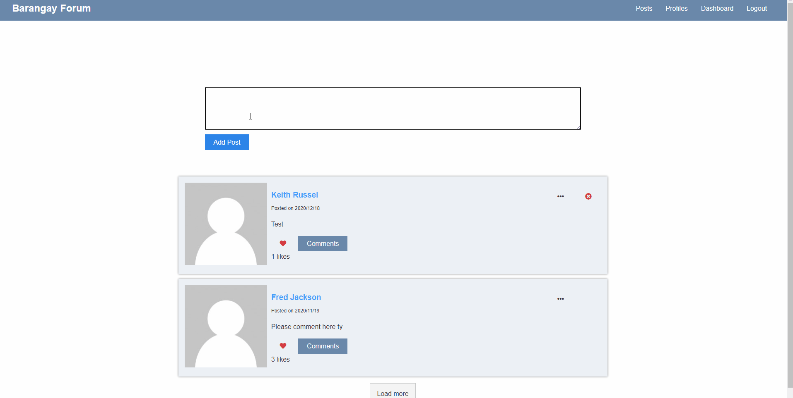

# Barangay Forum

Barangay Forum is a website app where the users can post their complaint or suggestions to their barangay, so they can make their place better and peaceful.
Check the [sample link](https://murmuring-everglades-39775.herokuapp.com/)



## Installation

If you want to run to your local make sure you have nodejs on your desktop/laptop.

```
npm start #run client side
npm server #run server side
npm dev #run both client and server side
```

## Features

- Auth Login & Register
- Profile Setup
- Edit Profile
- Avatar must proceed to gravatar.com register your email there
- Delete Account (Including Profile & Deleted User Comments)
- Post (CRUD functionality)
- Heart post
- Comment on post

## Tech Used

- MongoDB
- Express
- Reactjs
- Nodejs
- JWT auth
- Redux (State Management)
- Bcryptjs
